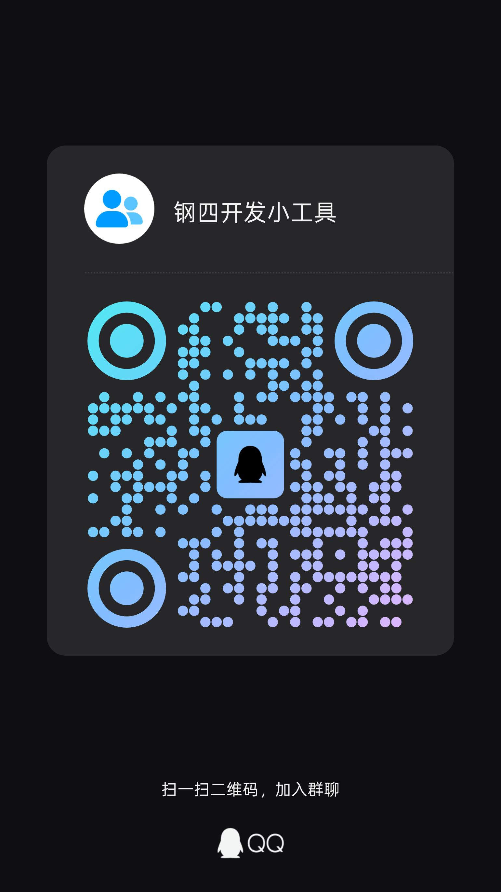

# hoi4skill

**hoi4skill** 是一个中文优先的 **Hearts of Iron IV（钢铁雄心 IV）MOD 辅助创作工具**。

它的目标很简单：把中文设计稿、国策草图、事件卡片、决议/民族精神/科技设定等内容，尽量安全地转换成 HOI4 可以识别的文件，并提供校验、索引和 `error.log` 反向分析能力。

> 本项目为非官方 MOD 工具，不隶属于 Paradox Interactive，不包含、不分发任何 Hearts of Iron IV 游戏资产。

---

## 1. 功能

本仓库目前主要包含两个部分：

- `hoi4-mod-maker/`：可安装的 Skill 包与参考文档。
- `hoi4skill-cli/`：Rust 编写的 CLI 后端，不依赖 Python 或 PowerShell 运行环境。

### 当前已支持

- **创建 MOD 骨架**：快速生成基础 MOD 文件夹结构。
- **扫描现有 MOD**：在修改前读取 MOD 风格、文件结构和已有内容。
- **静态校验**：检查常见 HOI4 MOD 错误，减少启动爆炸概率。
- **国策树生成**：从纯文本草图或 Excel 表格画出的国策树生成 focus tree 相关文件，国策坐标按同一行 `x` 间隔 2 防重叠。
- **卡片式内容解析与写入**：支持决议、民族精神、事件、科技、特殊 GUI、scripted helper、state-effect 等内容。
- **GFX 图标注册**：辅助把图标注册到 `interface/*.gfx`。
- **游戏 / MOD 索引构建**：索引国家 tag、sprite、state、province、technology 等引用信息。
- **历史文件编辑计划**：在修改 `history/states` 等危险区域前，先生成编辑计划，避免乱猜 state id / province id。
- **`error.log` 反向分析**：读取 HOI4 报错日志，辅助定位和修复 MOD 问题。
- **本地化快速翻译**：读取任意 `localisation/<source_language>`，对照目标语言键名，生成任意目标语言的翻译 prompt / yml 骨架，并支持写回后查漏。
- **AI 工作流辅助**：适合配合 Codex、ChatGPT、啊拼等工具，把“人话需求”转成带证据闸门的 MOD 文件改动，先确认上下文够不够，再限制可写文件范围。

### 构建方式

```text
cd hoi4skill-cli
cargo build --release
```

编译后的二进制文件通常位于：

```text
hoi4skill-cli/target/release/hoi4skill.exe
```

快速检查：

```text
hoi4skill-cli/target/release/hoi4skill.exe --help
```

### 示例命令

```text
hoi4skill scaffold --name "My HOI4 Mod" --output "M:\path\my_mod" --launcher-file
hoi4skill mod-knowledge "M:\path\existing_mod" --mod-path "M:\path\dependency.mod" --output mod_knowledge.json
hoi4skill prepare-edit-context --input "M:\path\copy.txt" --mod-root "M:\path\existing_mod" --tag SOV --prefix sov_nep --output edit_context.md
hoi4skill run-workflow --input "M:\path\copy.txt" --mod-root "M:\path\existing_mod" --tag SOV --prefix sov_nep --output workflow_report.json
hoi4skill plan-history-edit "M:\path\existing_mod" --text "edit history/states owner for state_id 64" --state-id 64 --game-root "C:\path\Hearts of Iron IV" --output history_plan.json
hoi4skill parse-focus-excel --input "M:\path\focus_tree.xlsx" --tag SOV --prefix sov_excel --sheet FocusTree --output focus_tree.txt
hoi4skill translate-localisation --mod-root "M:\path\existing_mod" --from english --to simp_chinese --format prompt --output loc_translate_prompt.md
hoi4skill translate-localisation --mod-root "M:\path\existing_mod" --from french --to german --format prompt --output loc_fr_to_de_prompt.md
hoi4skill translate-localisation --mod-root "M:\path\existing_mod" --from french --to german --translated-input translated_l_german.yml --apply --report loc_apply_report.json
hoi4skill validate "M:\path\existing_mod" --game-root "C:\path\Hearts of Iron IV"
```

### 适合谁使用

- 想做 HOI4 MOD，但不想手搓每一个大括号的人。
- 想用 AI 辅助写 MOD，但又担心 AI 把文件结构写炸的人。
- 想把中文设定、国策构想、事件草稿变成结构化 MOD 文件的人。
- 想给自己的 MOD 团队建立更稳定工作流的人。

### 安装到 AI 编程工具

本仓库的 `hoi4-mod-maker/` 是标准 `SKILL.md` 技能包，可用于 Codex、OpenCode、Claude Code 以及其他兼容 Agent Skills 的工具。

最省事的方式是下载 GitHub Releases 里的 `hoi4skill-agent-skill-v*.zip`，按 [INSTALL_AGENT_SKILL.md](INSTALL_AGENT_SKILL.md) 解压到对应目录。

也可以直接从源码路径安装：

```text
https://github.com/zhangxiaoyu66666/hoi4skill/tree/main/hoi4-mod-maker
```

---

## 2. 未来可能会做什么

下面是一些可能的发展方向，不代表一定会做，也不保证时间表。开源项目画饼可以，烙饼要命，先把能用的部分做好。

### 可能开发图形化前端

未来可能会开发一个更适合普通玩家使用的前端界面，让用户不必直接面对命令行。

设想中的前端可能包括：

- MOD 项目管理面板；
- 国策树可视化编辑器；
- 事件链 / 决议 / 民族精神卡片编辑器；
- `error.log` 可视化诊断；
- GFX 图标注册与预览；
- 一键校验、一键生成、一键导出；
- 与 AI 工具联动，把自然语言需求转成可检查的 MOD 改动计划。

### 可能适配更多 Paradox Interactive 游戏

hoi4skill 当前优先服务于 Hearts of Iron IV，但长期目标不一定只局限于 HOI4。

未来如果条件允许，可能会逐步探索适配更多 P 社游戏的 MOD 工作流，例如：

- Europa Universalis 系列；
- Crusader Kings 系列；
- Victoria 系列；
- Stellaris；
- 其他使用相近脚本结构和 MOD 组织方式的 Paradox 游戏。

理想状态下，它不只是一个 HOI4 工具，而是一个面向 **P 社游戏 MOD 创作的中文优先工具链**。

### 可能增强 AI 工作流

未来可能会继续强化：

- 从一句话生成 MOD 原型；
- 从设计文档生成国策、事件、决议；
- 从已有 MOD 中学习命名风格和文件布局；
- 自动生成本地化文本；
- 自动分析报错并给出修复建议；
- 为 Codex / ChatGPT / 啊拼等工具提供更稳定的后端能力。

---

## 3. 赞助与交流

hoi4skill 目前主要由个人维护。如果这个项目帮你少踩一次 HOI4 MOD 的坑，或者让你少和大括号搏斗半小时，欢迎赞助支持，由于项目主要贡献者是一名尝试自力更生的二级残疾人（https://github.com/zhangxiaoyu66666），如果您想项目可以走得更远，有能力的情况下建议赞助。

赞助会主要用于：

- 继续开发 hoi4skill；
- 测试更多 HOI4 MOD 场景；
- 完善文档和示例；
- 未来可能的图形化前端开发；
- 适配更多 P 社游戏；
- 维持开源项目的长期更新。

### 赞助二维码


### QQ 交流群



也欢迎通过 GitHub Issues 提交问题、建议和使用反馈和点击小星星。

---

## 4. 许可证

hoi4skill 采用 **GNU General Public License v3.0 only（GPL-3.0-only）** 发布。

详情请查看仓库中的 [LICENSE](LICENSE)。

### 发布与使用注意

请不要把本地生成文件、游戏文件或第三方资产误传到公开仓库中：

Hearts of Iron IV、Paradox Interactive 及相关名称属于其各自权利人。本项目只是非官方 MOD 辅助工具，不包含游戏资产，也不代表 Paradox Interactive 官方立场。
